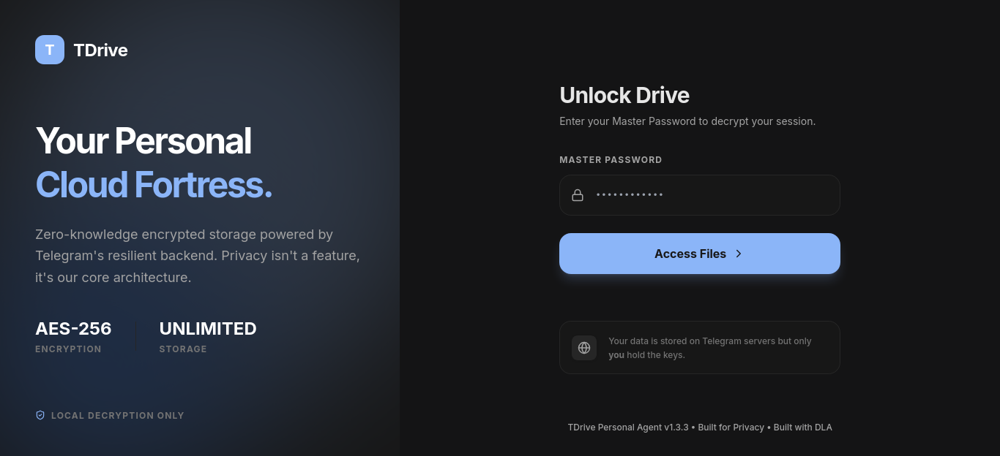

# TDrive (Telegram Drive)

TDrive is a personal cloud storage system that utilizes Telegram Private Channels as a storage backend. It provides a self-hosted alternative to traditional cloud storage providers by leveraging Telegram's MTProto protocol for data transmission and AES-256-GCM for local data encryption.



## Features v1.4.0

### Storage and File Management
- Streaming Upload and Download: Support for large files using chunk-based streaming to minimize memory usage.
- Virtual File System: Full virtual folder hierarchy management independent of the storage backend.
- Trash Bin: Complete lifecycle including soft-delete, restore, and permanent purge.
- Preview System: Automatic thumbnail generation for images and videos with local caching.
- Advanced Search: Fast file indexing with support for metadata filters like starred:true.
- Starred Items: Ability to mark and quickly access favorite files.
- Bulk Operations: Support for bulk trash movements and streaming ZIP generation for multiple files.

### Security and Privacy
- End-to-End Encryption: Local AES-256-GCM encryption before data transmission.
- Master Password: Key derivation using PBKDF2-HMAC-SHA256 ensuring no keys leave the local environment.
- HMAC Metadata Protection: Signed Telegram message captions to prevent unauthorized metadata tampering.
- Brute Force Defense: Progressive delays and automatic account lockout for failed login attempts.
- CSRF Protection: Comprehensive protection for all state-changing API requests.

### Reliability and Recovery
- Cloud Index Rebuild: Reconstruction of the local database by scanning Telegram channel history.
- Disaster Recovery: Automatic synchronization of system salts and metadata from cloud tags.
- Integrity Guard: Automatic safe mode (read-only) when system inconsistency is detected.
- Job Recovery Worker: Background process to manage and recover interrupted transfer tasks.

### Analytics and Monitoring
- Storage Analytics: Dashboard with total usage, file type distribution, and capacity metrics.
- Usage Statistics: Categorical breakdown of storage usage (Video, Images, Documents, etc.).
- Developer Mode: Integrated console for live logs, performance metrics (CPU/RAM/Disk), and diagnostics.
- Support Bundles: One-click generation of encrypted diagnostic bundles for troubleshooting.

### Platform Support
- Web Dashboard: Responsive interface built with Next.js 14 and TailwindCSS.
- Telegram Bot Interface: Interactive bot for remote file browsing, searching, and status monitoring.
- CLI Management: Command-line interface for administrative tasks, initialization, and backups.
- Cross-Platform: Native support for Linux, Windows, and Docker environments.
- Encrypted Backups: AES-256-GCM encrypted state backups via CLI.

## Technical Architecture

- **Backend**: Python 3.12+, FastAPI, Telethon (MTProto), SQLAlchemy (SQLite).
- **Frontend**: Next.js 14 (App Router), TanStack Query, Zustand, TailwindCSS.
- **Deployment**: Supports systemd services and Docker Compose.

## Documentation

Detailed documentation is available in the `docs/` directory:
- [Security Architecture](docs/security.md)
- [Repository Integrity Guard](docs/integrity.md)
- [Windows Setup Guide](docs/windows_setup.md)
- [CLI Reference](docs/cli.md)
- [API Documentation](docs/README.md)

## Installation and Configuration

### 1. Prerequisites
- **Python**: Version 3.12 or higher.
- **Node.js**: Version 20.x or higher.
- **Telegram API**: Obtain `api_id` and `api_hash` from [my.telegram.org](https://my.telegram.org).
- **Storage Channel**: Create a **Private Channel** in Telegram and get its ID (e.g., `-100...`).

### 2. Backend Setup
Clone the repository and initialize the environment:
```bash
python3 -m venv venv
source venv/bin/activate
pip install .  # Use 'pip install -e .' for development mode
```

Initialize configuration:
```bash
tdrive init
```

Authenticate with Telegram:
```bash
tdrive login
```

### 3. Frontend Setup
```bash
cd web
npm install
npm run build
```

### 4. Deployment (Linux)
```bash
sudo ./scripts/finalize.sh
```

## Usage

### Accessing the Dashboard
The dashboard is accessible via `http://localhost:3000`.

### Security Best Practices
- **Master Password**: Keep your Master Password safe. If lost, your encrypted data on Telegram cannot be recovered.
- **Private Channel**: Keep your storage channel **Private**. Do not set it to "Public" as it will expose your data.
- **Access Control**: Use a secure tunnel (like Tailscale or Cloudflare) if exposing the dashboard to the internet.

## Fuel the Engine

TDrive is open-source and free, but my coffee machine is neither. If this project has made your life easier (or at least more interesting), feel free to support the ongoing development:

[**Fuel the Project via Saweria**](https://saweria.co/dimasla)

*P.S. Donating won't technically make me a better coder, but it will definitely reduce the number of 'fixed stuff' commit messages.*

## License

This project is licensed under the MIT License.
